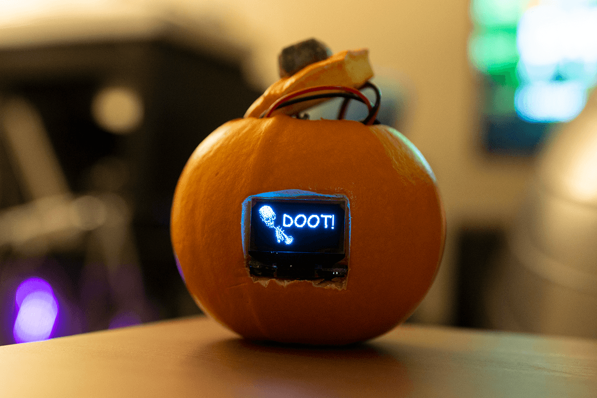
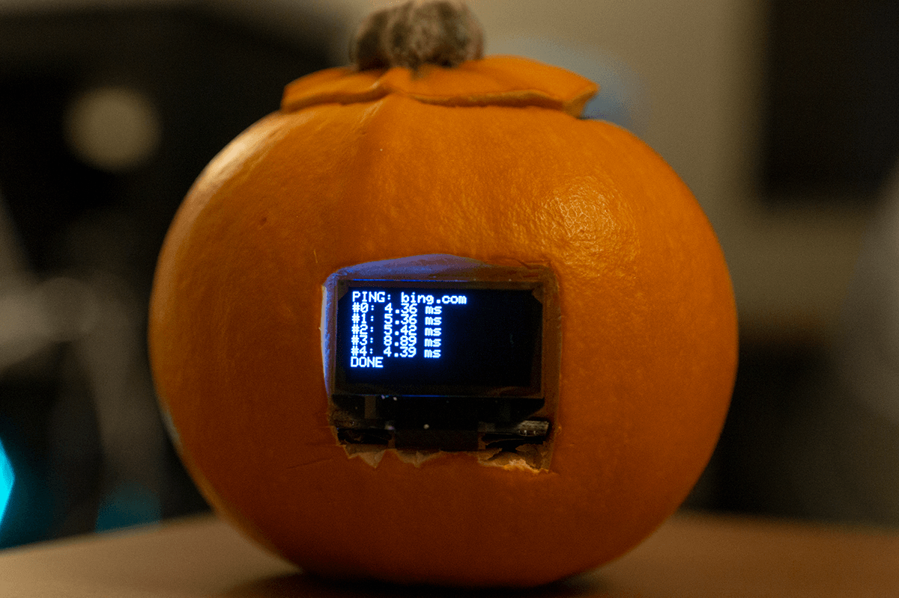

# Cyber Pumpkin
AKA IOT-O'-Lantern

The digital pumpkin of the future (not really).

<!-- todo: image with the top on? -->
<!-- todo: gif -->

## What?

This is an Internet of Things pumpkin with a monochrome 128x64 pixel OLED display. It is powered by an ESP32 dev board and can run on batteries.
By default, it shows an animation on a loop, but I can also change the image or animation on the screen dynamically using TCP.

## Why?

My group at work was holding a pumpkin carving contest. I am not very good at carving pumpkins,
but I do know how to shove electronics into things.

Also, because I work on networking I _had_ to include a ping test.

## How does it work?

To set the new image, I send over a big buffer containing all of the pixel data for all the frames to port 8001.
Previously, I had tried to use base64 encoded data over HTTP (to make sending easier, I could just curl it),
but manipulating the request was more effort than it was worth. The first few bytes contain the mode, the number of frames,
and the time between each frame.

I reuse this same buffer for modes that don't send image data, like the ping test and the text only mode.

The script `send_image.py` can read either GIFs or 1 bit per pixel BMPs and handles sending this data.

`pumpkin_ping.py` handles sending the data necessary for the ping test.

## How do I get the image data?

I use GIMP for this. Under `Image > Mode > Indexed...` there are settings to convert images to 1 bit per pixel black and white, and optionally with
dithering. Once it's saved in this format, I use `pillow` to read the image data, which I then convert into the binary format used by the graphics library.

### Parts List

- SSD1306 128x64 OLED display
- ESP32 Dev Board
- Various lengths of wire, female pin headers
- 1 small pumpkin (yes, it's real! I baked the seeds)
